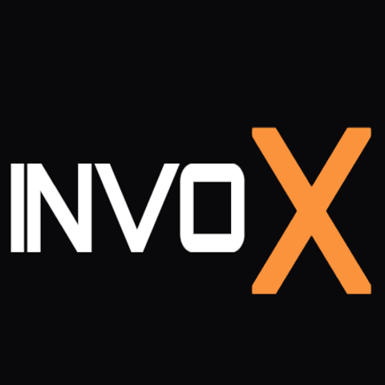
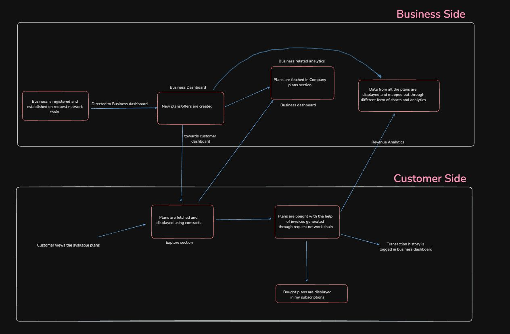

[![Contributors][contributors-shield]][contributors-url]
[![Forks][forks-shield]][forks-url]
[![Stargazers][stars-shield]][stars-url]
[![Issues][issues-shield]][issues-url]
[![MIT License][license-shield]][license-url]

# InvoX

### Redefining Subscription Management with Blockchain and Request Network

InvoX is a decentralized platform that empowers subscription-based businesses to manage their plans, payments, and analytics securely on the Ethereum blockchain. Customers can subscribe to plans anonymously using cryptocurrencies, ensuring privacy and eliminating reliance on centralized systems.

Do go through our wonderful [Docs](https://app.gitbook.com/o/qDx2k3qs7IqafWm79rJm/s/FYDnsrhBthdB6uvYuQHY/)
---

## Key Features 🌟

### 1. Decentralized Subscription Management
Businesses can create and manage subscription plans that are securely stored on the Ethereum blockchain. This ensures trust, transparency, and data integrity.

### 2. Automated Invoicing
Each subscription purchase generates a tamper-proof, decentralized invoice powered by the **Request Network**. These invoices are stored immutably on IPFS, ensuring they are both secure and permanent.

### 3. Secure Payments
Accept ETH and stablecoins through a decentralized payment flow, providing a private and efficient experience for customers.

### 4. Real-Time Analytics
A user-friendly dashboard provides insights such as:
- Total revenue (all-time and monthly).
- Customer distribution across plans.
- Revenue trends over time.
- Geographical distribution of customers.

These insights help businesses make data-driven decisions and optimize their subscription offerings.

---

## Why InvoX? 🚀

For businesses selling subscription plans with cryptocurrencies, tracking performance and managing customer data is challenging without a structured system. InvoX addresses this by integrating blockchain-powered automation and decentralized invoicing to:
- Simplify revenue tracking.
- Provide detailed customer insights.
- Eliminate manual processes and guesswork.
- Enable customers to buy their favorite subscriptions seamlessly using cryptocurrencies.
---

## Application Flow 📂

Explore how InvoX operates with this detailed flowchart:  

---

## Try It Out! 🌐

Experience InvoX in action by visiting the deployed application:  
[InvoX](https://invox-pay.netlify.app)
<!-- MARKDOWN LINKS & IMAGES -->

[contributors-shield]: https://img.shields.io/github/contributors/KPR-V/InvoX.svg?style=for-the-badge
[contributors-url]: https://github.com/KPR-V/InvoX/graphs/contributors
[forks-shield]: https://img.shields.io/github/forks/KPR-V/InvoX.svg?style=for-the-badge
[forks-url]: https://github.com/KPR-V/InvoX/network/members
[stars-shield]: https://img.shields.io/github/stars/KPR-V/InvoX.svg?style=for-the-badge
[stars-url]: https://github.com/KPR-V/InvoX/stargazers
[issues-shield]: https://img.shields.io/github/issues/KPR-V/InvoX.svg?style=for-the-badge
[issues-url]: https://github.com/KPR-V/InvoX/issues
[license-shield]: https://img.shields.io/github/license/KPR-V/InvoX.svg?style=for-the-badge
[license-url]: https://github.com/KPR-V/InvoX/blob/main/LICENSE.txt
